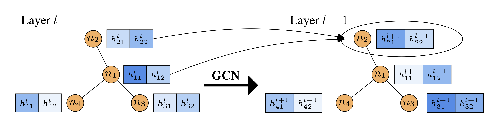
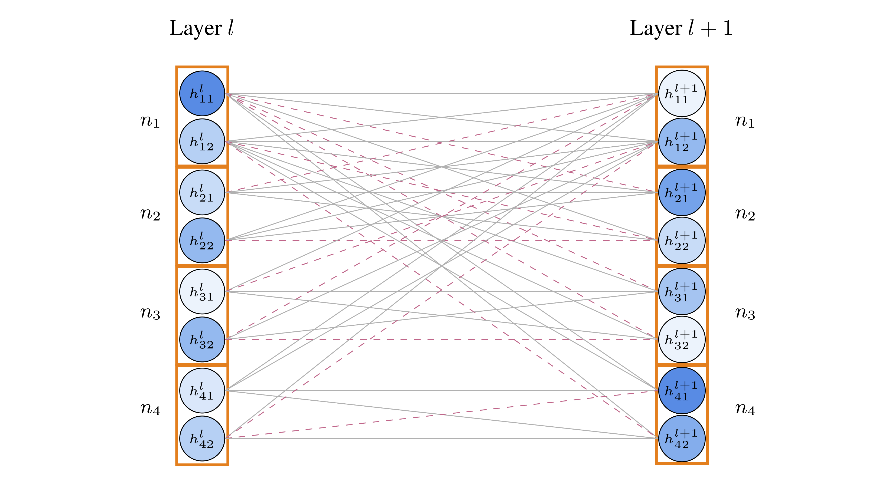

Beta-Bernoulli Graph DropConnect (BB-GDC)
============

This is a PyTorch implementation of the BB-GDC as described in our paper:

A. Hasanzadeh*, E. Hajiramezanali*, S. Boluki, M. Zhou, N. Duffield, K. R. Narayanan, and X. Qian, [Bayesian Graph Neural Networks with Adaptive Connection Sampling](https://arxiv.org/abs/2006.04064), International Conference on Machine Learning (ICML), 2020, *equal contribution





**Abstract:** We propose a unified framework for adaptive connection sampling in graph neural networks (GNNs) that generalizes existing stochastic regularization methods for training GNNs. The proposed framework not only alleviates over-smoothing and over-fitting tendencies of deep GNNs, but also enables learning with uncertainty in graph analytic tasks with GNNs. Instead of using fixed sampling rates or hand-tuning them as model hyperparameters in existing stochastic regularization methods, our adaptive connection sampling can be trained jointly with GNN model parameters in both global and local fashions. GNN training with adaptive connection sampling is shown to be mathematically equivalent to an efficient approximation of training Bayesian GNNs. Experimental results with ablation studies on benchmark datasets validate that adaptively learning the sampling rate given graph training data is the key to boost the performance of GNNs in semi-supervised node classification, less prone to over-smoothing and over-fitting with more robust prediction.


## Cite

Please cite our paper if you use this code in your own work:

```
@misc{hasanzadeh2020bayesian,
    title={Bayesian Graph Neural Networks with Adaptive Connection Sampling},
    author={Arman Hasanzadeh and Ehsan Hajiramezanali and Shahin Boluki and Mingyuan Zhou and Nick Duffield and Krishna Narayanan and Xiaoning Qian},
    year={2020},
    eprint={2006.04064},
    archivePrefix={arXiv},
    primaryClass={cs.LG}
}
```
